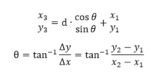
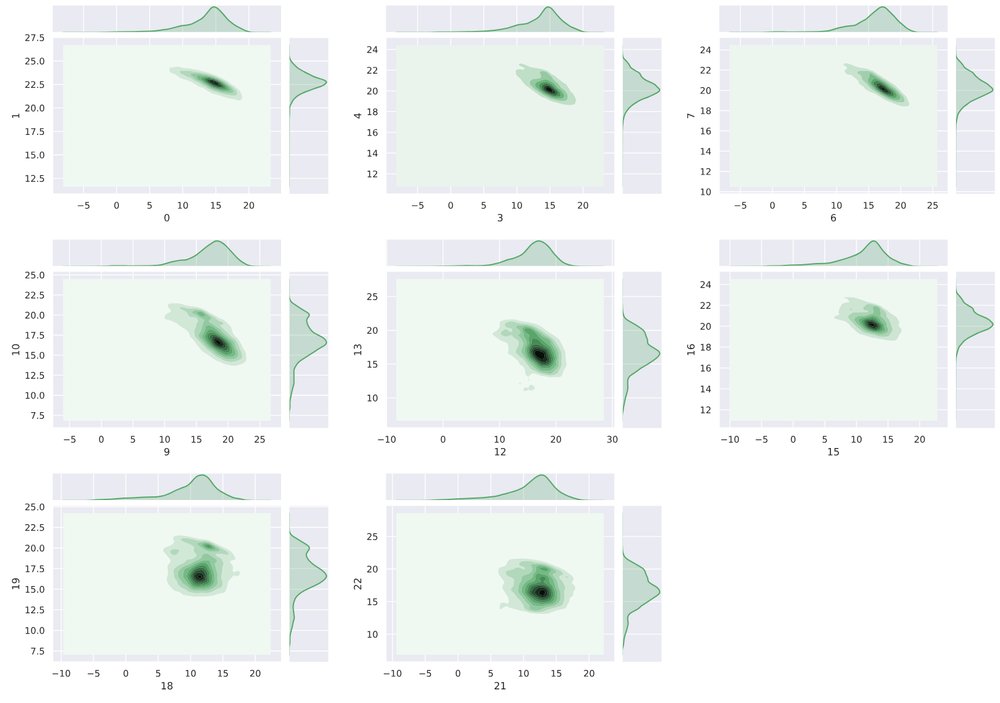
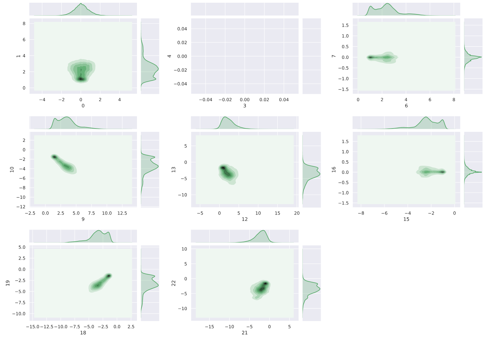
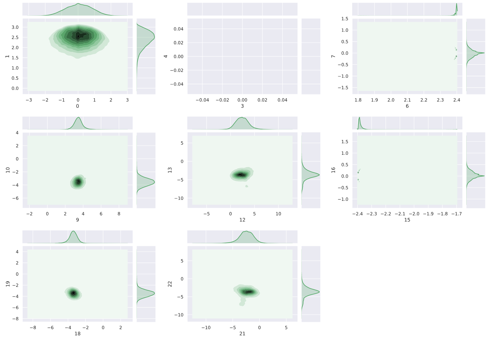

# Co-Speech Gesture Generation
A PyTorch implementation of "Robots Learn Social Skills: End-to-End Learning of Co-Speech Gesture Generation for Humanoid Robots".
```
@article{yoon2018robots,
  title={Robots Learn Social Skills: End-to-End Learning of Co-Speech Gesture Generation for Humanoid Robots},
  author={Yoon, Youngwoo and Ko, Woo-Ri and Jang, Minsu and Lee, Jaeyeon and Kim, Jaehong and Lee, Geehyuk},
  journal={arXiv preprint arXiv:1810.12541},
  year={2018}
}
```

---
## Seq2pos Model Strucuture


---
## Transformer Model Structure
- TODO

---
## TED Dataset Visualization
 - The dataset was pre-processed by l2 norm, relocating neck coordination, and shoulder length normalization in order 
 - The below equation was used to nomralize shoulder length:



- After l2 norm


- After re-locating neck coordination


- After normalizing shoulder length


---
## Result
- Model overfitting was observed. 
  But the model still is able to produce gesture output like Youngwoo.

- Seq2pos loss


- Transformer loss 
 